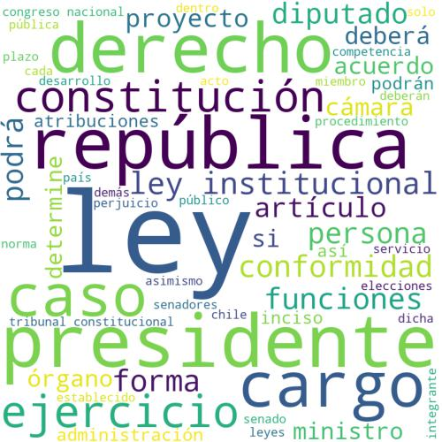

# Text summarization / Resumen de textos

## Word clouds

A first approach to text analysis using the Chilean constitutional law proposal. 

--------------

Una simple representación de la propuesta constitucional usando word clouds. 

--------------

--------------

Libraries used:
- re
- PyPDF2
- nltk
- wordcloud
- matplotlib